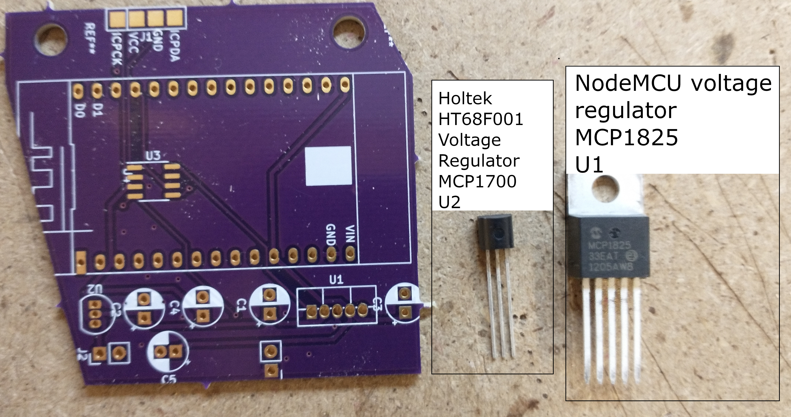
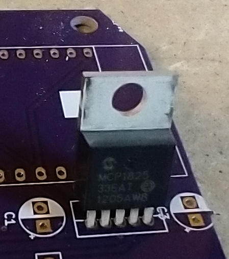
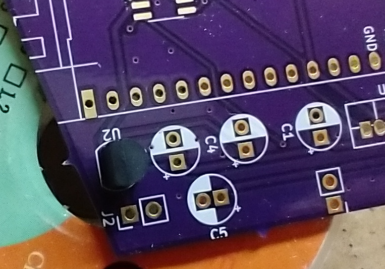
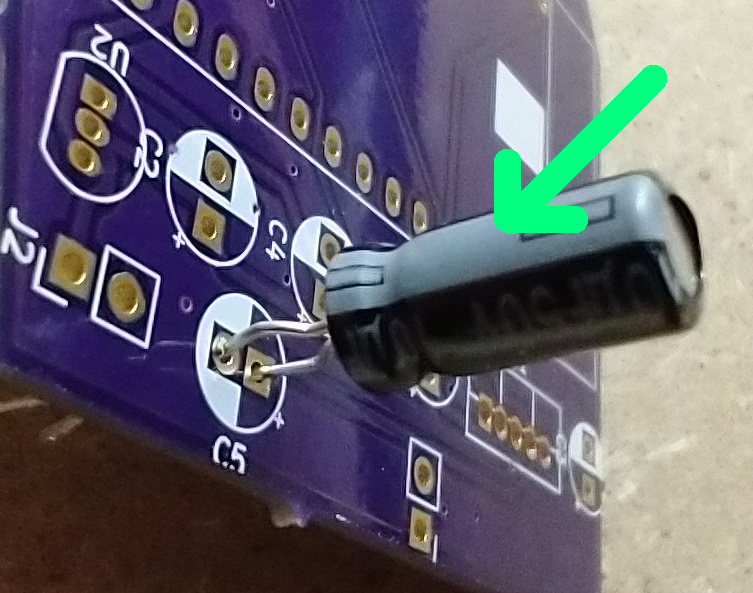
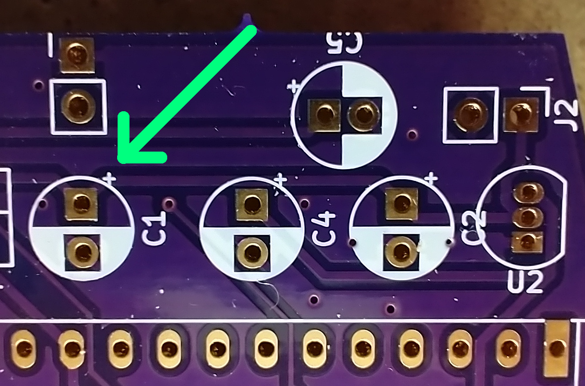
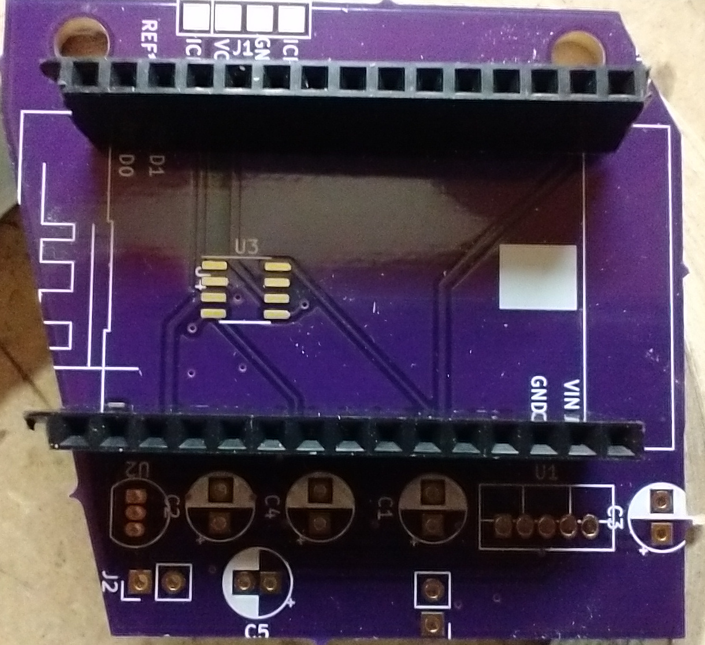
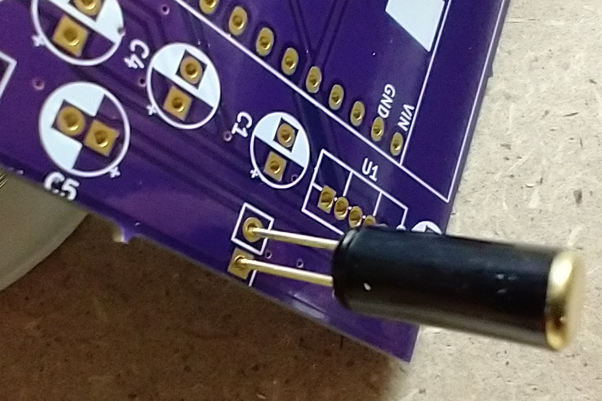
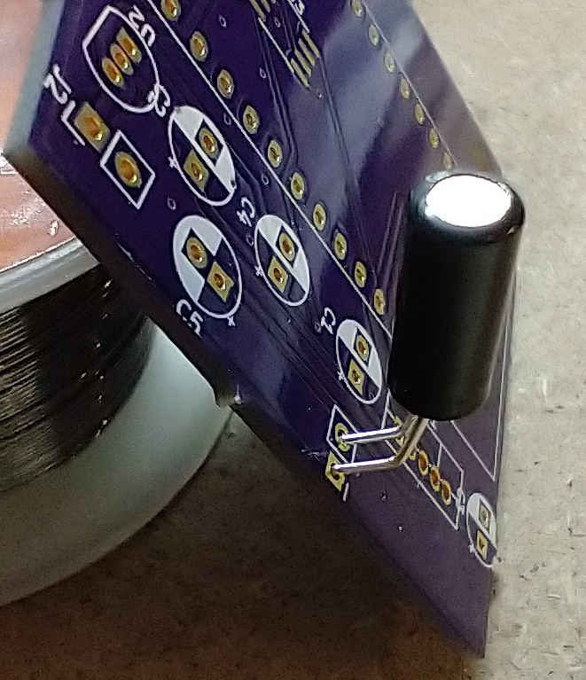
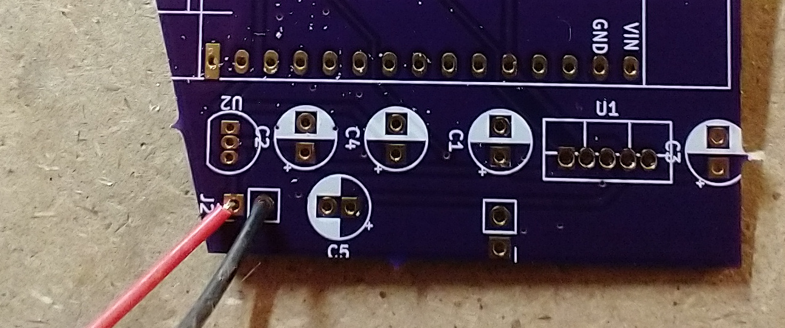
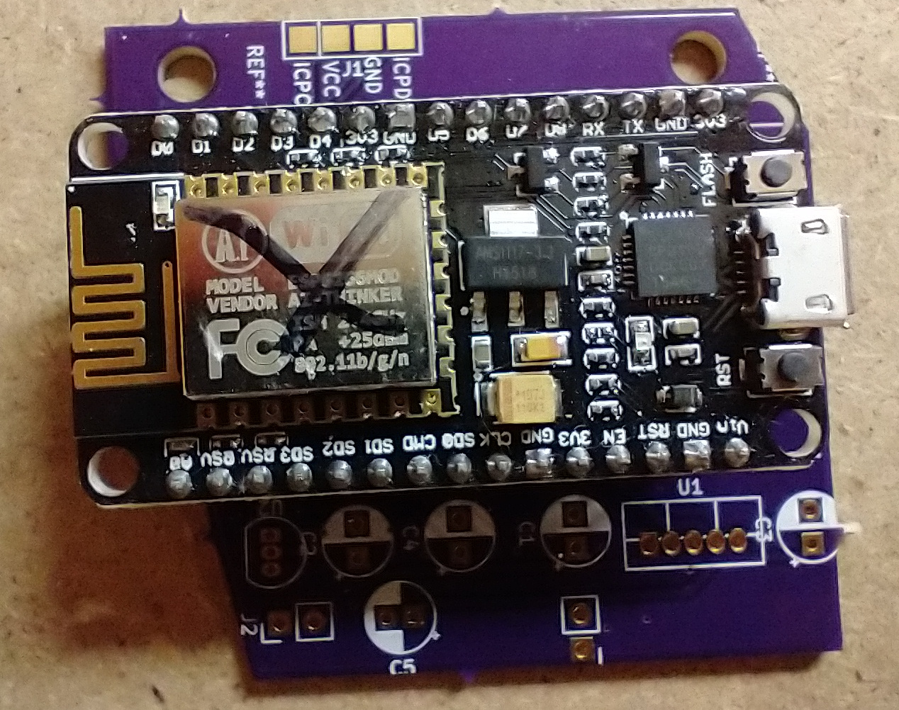

# Assembly Notes

## Soldering on the voltage regulators
There are two voltage regulators. One provides 3.3v to the Holtek HT68F001 microcontroller, (U2), and the other provides 3.3v to the NodeMCU, with an enable switch (U1).

Solder the MCP1825 voltage regulator into the U1 spot.

Solder the MCP1700 voltage regulator into the U2 spot. The solder mask matches the orientation for the part.

## Soldering on the Capacitors

Solder the Capacitors into the C1, C2, C3, C4 and C5 spots. Make sure to orient them correctly. They are polarized and if put in backwards, they will explode.

There is a white line on one side of the capacitor that shows the negative pin. That pin goes into the hole that has the white half of the circle. See the following picture for an example of the capacitor inserted correctly. The arrow shows the white line on the capacitor showing the negative pin.

There is also a positive mark on the board next to each capacitor circle. That is where the positive pin should be inserted.

## Soldering on the Headers for the NodeMCU

Solder the two strips of headers onto the board. Make sure the headers are flush with the board, or else it will be hard to insert the NodeMCU.

## Soldering on the Tilt Switch

I forgot to leave the designation for the tilt switch on the pcb. It goes in the spot under the C1 capacitor spot. When soldering this in, don't press the component up against the board. See the following picture for an example and for the tilt switch location.

Then using a pair of needle nose pliers gently bend the legs of the tilt switch so that the body of the tilt switch is approximately rotated 45 deg in relation to the pcb. Don't bend it by grabbing the body of the component or you might break off the tilt switch. See the picture below for an example. This will help prevent false positives when the door shakes ie from the wind.

## Soldering on the battery holder

I also forgot to mark the polarity for the battery holder. See the following picture for the correct polarity.

## Program and insert the NodeMCU

Upload the program for the NodeMCU according to the software instructions. Then insert it into the headers.

## Screw the circuit board into the case

I screwed up the screw holes on this board, so you'll need to use the washers to keep them from pulling through.

## Tape in the battery holder

Using a small piece of mounting tape, stick the a piece on the back of the battery holder then stick it into the case.

## Final assembly

