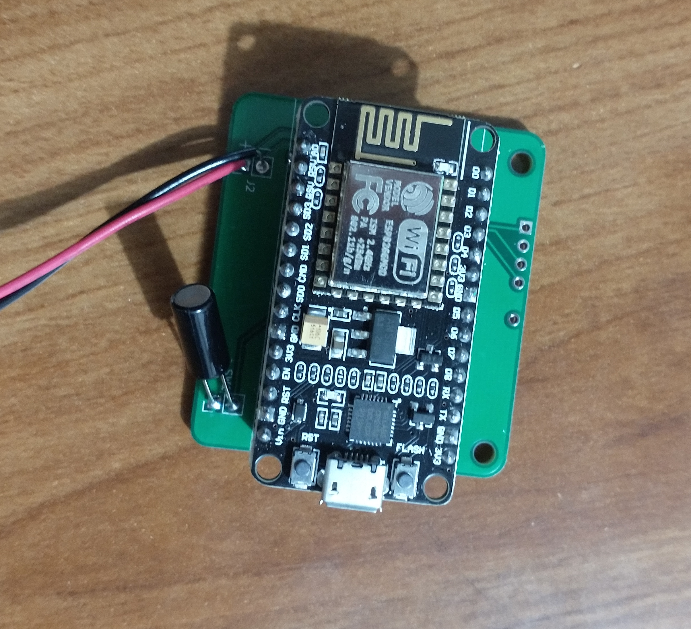
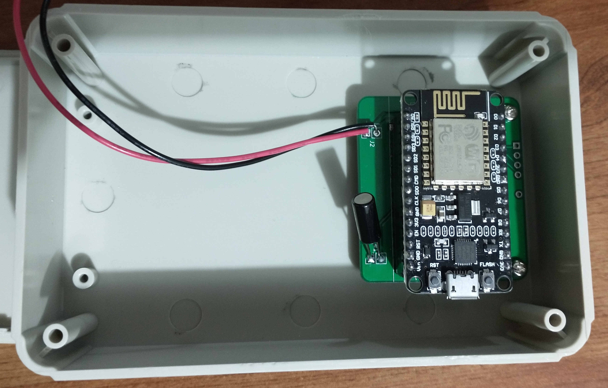
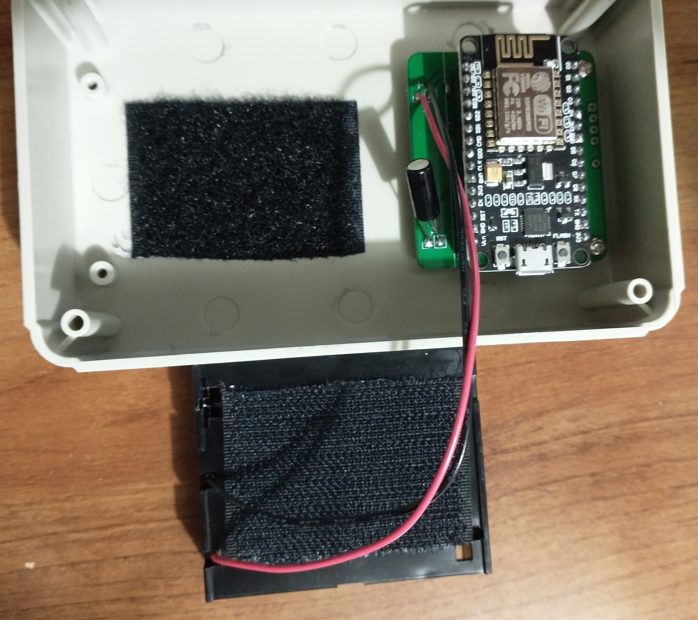
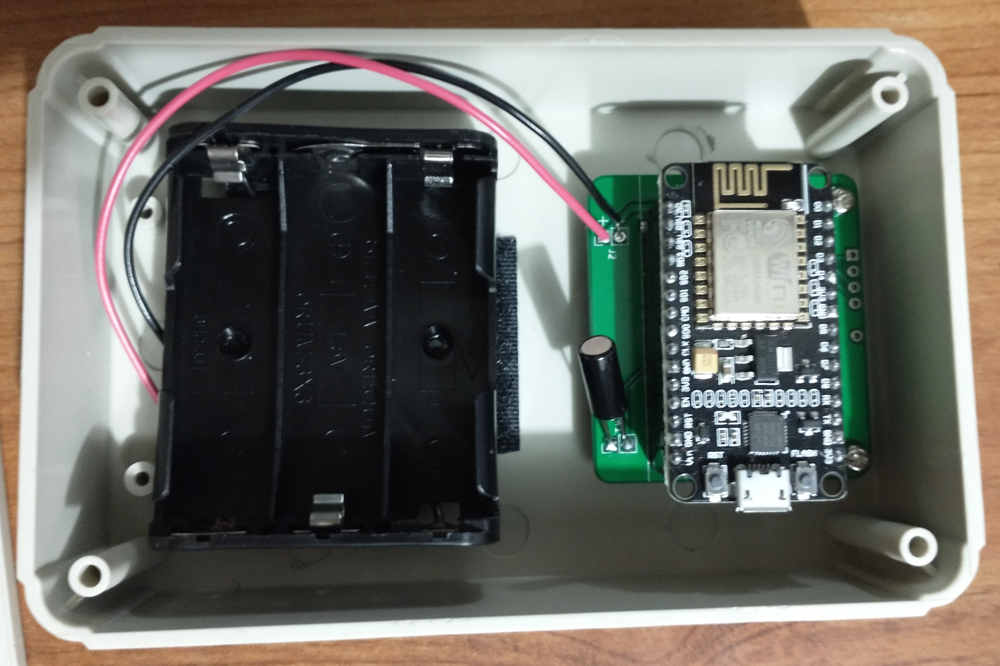

# Hardware Assembly

## Additional items needed.

Phillips screw driver

3x AA batteries

## Program and insert the NodeMCU

Upload the program for the NodeMCU according to the [software instructions](https://github.com/thinklearndo/garagedooropennotifier/blob/main/SoftwareSetup.md). Then insert it into the headers.

## Screw the circuit board into the case

## Put hook and latch material on battery holder and inside case

Get the smaller patch of hook and latch material to put one side on the back of the battery holder and the other side inside the case to the left of the circuit board. Press the battery holder firmly into the box and make sure the hook and latch material is connected well.

## Final assembly

When mounting it to the garage door, make sure the orientation of the box is correct. The top of the tilt switch should be pointed up.

Also, the box needs to be mounted similar to the picture. The back of the pcb needs to be against the garage door and the tilt switch needs to be facing into the garage.

When the garage door is open, the tilt switch needs to be towards the ground. Otherwise the tilt switch won't work correctly and it will always say the garage door is closed.

Get the large patch of hook and latch material and place one side on the back of the box and the other at the top of the garage door. Firmly press the case against the hook and latch material to make sure it has a good connection. Insert AA batteries and screw on the lid.
