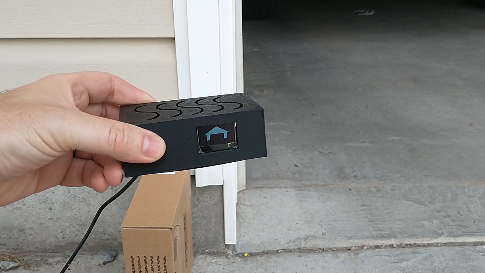
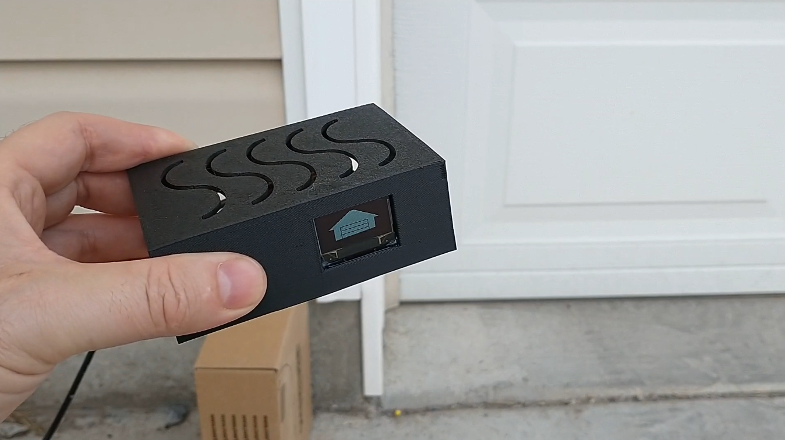

# garagedooropennotifier
A nodemcu project to notifiy users when the garage door gets left open.

For assembling the kit, see the [HardwareAssembly](https://github.com/thinklearndo/garagedooropennotifier/blob/main/HardwareAssembly.md)

For a 3d printable enclosure see the folder [3d_printer_files](https://github.com/thinklearndo/garagedooropennotifier/tree/main/3d_printer_files)

Then setup the software as specified in the [software setup](https://github.com/thinklearndo/garagedooropennotifier/blob/main/SoftwareSetup.md).

Kicad board files are in the boardfiles directory.

## OLED Raspberry Pi garage door state





To setup a Raspberry Pi + OLED garage door state indicator, check out the [indicator setup document](docs/oledsetup.md).

[See it in action.](https://youtu.be/mj3vsc2727k)

## Troubleshooting

To verify the nodejs server is working correctly, send a get request using a web browser to the server itself, by doing something like:
```
http://<nodejs server ip address>:3000/garageAlert?doorState=1&doorId=0
```
where ```<nodejs server ip address>``` is the address of the server running the nodejs program.

The web browser should have this kind of response:
```
garage door alert received
```
Then after 5 minutes has passed an email should be sent to the specified email address.

If the web browser doesn't get the expected response, verify the ip address of the server and that the nodejs program is running.

If an email is not sent, verify the email settings in the app.js file.

To verify the nodemcu is working correctly, take the cover off and remove a battery to power it off. Then with the garage door closed, insert the battery but leave the cover off. Open the garage door enough that the device is horizontal. Watch the led indicator for the nodemcu, it should blink blue to show it has turned on. Check the console for the nodejs server, there should be a log with this message:
```
garage alert request received
```

If the nodemcu does not turn on, check that the tilt switch is installed correctly.

If the nodemcu does turn on but no message is logged, check the wifi settings and ip address of the firmware that was uploaded to nodemcu.
