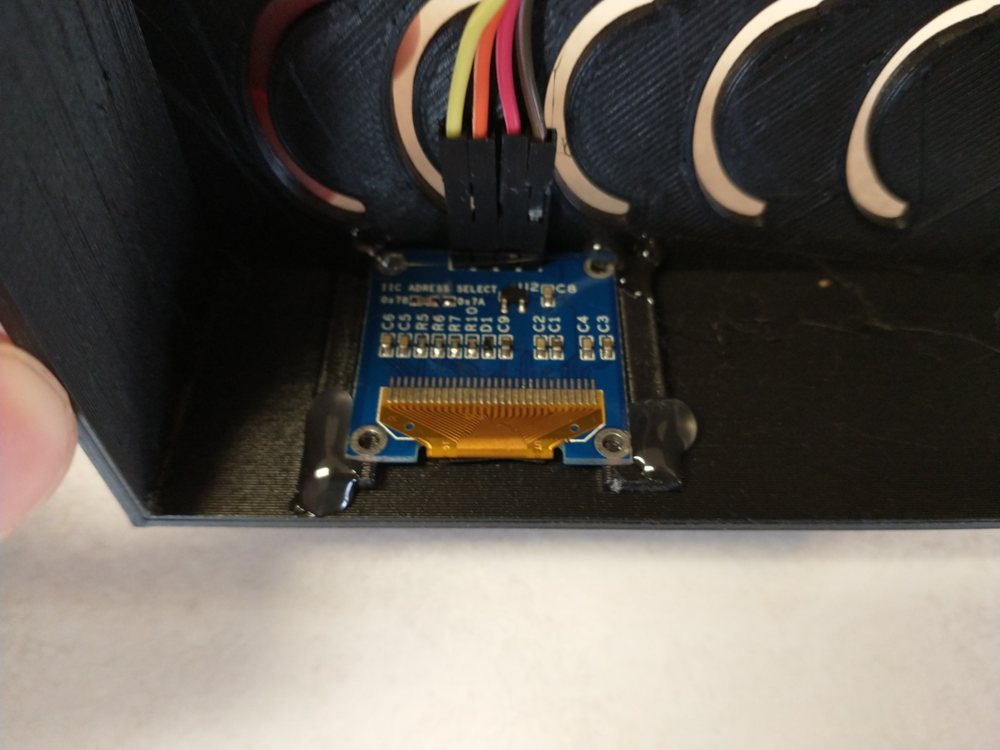

# Parts needed

1x raspberry pi, with operating OS and wifi

1x hot glue gun

1x OLED

4x female to femal jumper wires

1x garage door left open notifier setup to point to the raspberry pi

1x raspberry pi oled case [Stl here](../3d_printer_files/pi_oled_case_top_and_bottom.stl).

# Assembly for OLED garage state indicator

Print out the case pieces.

Insert the oled into the case, use hot glue to hold it. Wires go along the top of the lid.




Place the raspberry pi on the bottom. I didn't care if it moved around in there, so I didn't glue it in, but you can if you want it.

Connect the wires for the oled to the raspberry pi, according to the diagram.


Put the lid on the bottom piece, they should just snap together.


Plug in power for the raspberry pi and let it start up.

Install nodejs and git if needed: ```sudo apt install nodejs git```

Checkout the repo: ``` git checkout https://github.com/thinklearndo/garagedooropennotifier```

Install dependencies: ``` cd garagedooropennotifier/nodejs && npm install```

Start the nodejs server: ```nodejs app.js```

# Verifying operation

Open a web browser on another computer and go to this URL: ```http://<ip address of raspberry pi>/garageAlert?doorState=1&doorId=0```. The OLED should show the open garage door image.

Then to test that it will show the closed image, go to this URL ```http://<ip address of raspberry pi>/garageAlert?doorState=0&doorId=0```.
